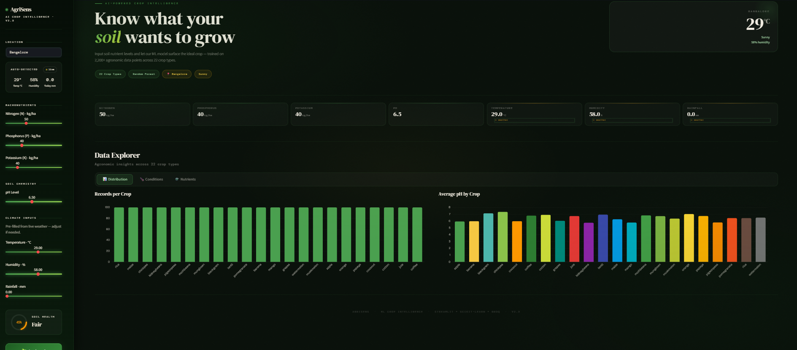
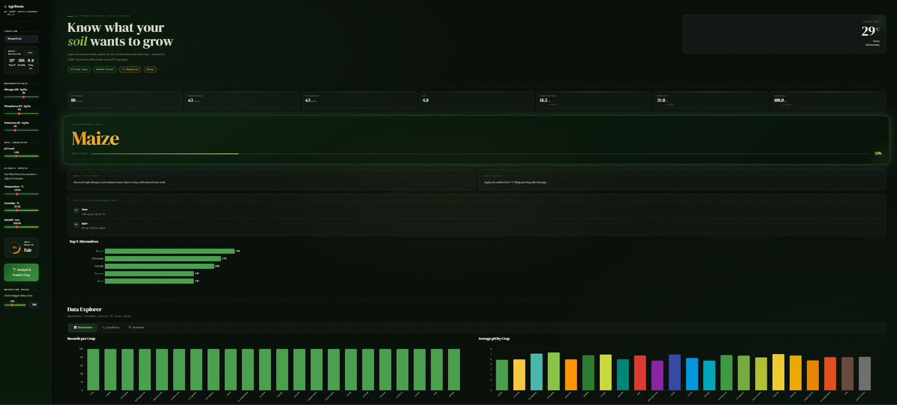
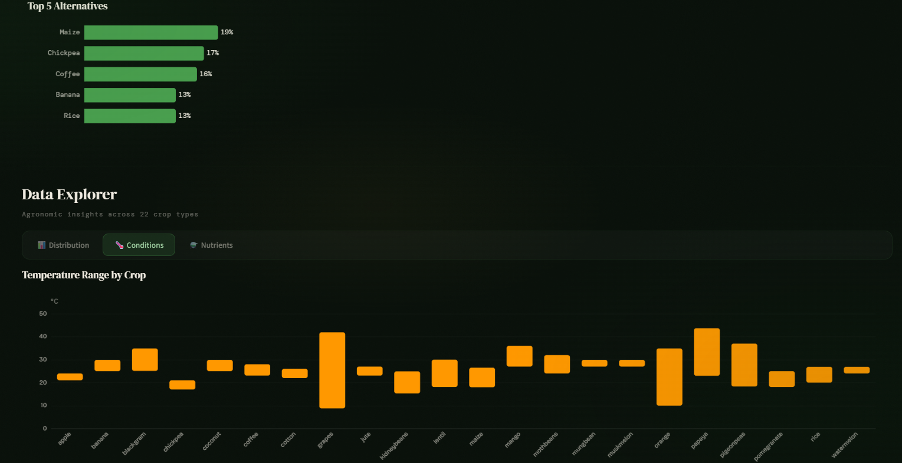
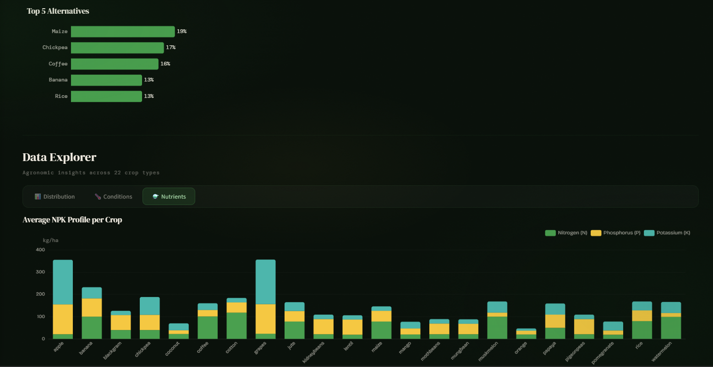

# 🌾 AgriSens — Smart Farming Assistant

AgriSens is a full-stack smart farming platform that combines a static web landing page with a Streamlit-powered ML dashboard for crop recommendation. It helps farmers make data-driven decisions using soil parameters, real-time weather, and an optional AI-powered insight engine.

> 🚀 **Live Demo:** https://agrisens-ai.streamlit.app/
> 📄 **Published in:** https://irjaeh.com/  
> 🔗 **DOI:** https://doi.org/10.47392/IRJAEH.2026.0038

---

## 🏆 Recognition

| Award | Details |
|---|---|
| 🥇 **Best Paper Presentation** | UG Category — iCREATE 2025, BITM & Global Conference Hub (Dec 27–28, 2025) |
| 📰 **Published Research** | IRJAEH, Volume 04, Issue 01, January 2026 · e-ISSN: 2584-2137 · Pages 276–279 |

**Certificates & Paper:**
- 📜 [Certificate of Achievement — Best Paper Presentation](certificates/best-paper-award-iCREATE2025.pdf)
- 📜 [Certificate of Publication — IRJAEH](certificates/publication-certificate-IRJAEH2026.pdf)
- 📑 [Published Paper — Hybrid Deep Learning Model for Crop Yield Prediction](certificates/hybrid-cnn-rf-crop-yield-prediction-IRJAEH2026.pdf)

---

## 📸 Screenshots

**Main Dashboard**


**Prediction Result — Maize**


**Data Explorer — Temperature Range by Crop**


**Data Explorer — Average NPK Profile per Crop**


---

## ✨ Features

- **Crop Recommendation** — Predicts the best crop based on soil nutrients (N, P, K), pH, temperature, humidity, and rainfall using a trained Random Forest model.
- **AI Insights (optional)** — Integrates with Groq's LLM API (Llama 3.1) to generate natural language farming advice for the predicted crop.
- **Live Weather** — Fetches real-time weather for the user's location, displayed in the sidebar.
- **Data Explorer** — Interactive charts (Plotly & Apache ECharts) showing NPK profiles, pH distributions, temperature ranges, and a feature correlation heatmap.
- **Web Landing Page** — Static HTML/CSS/JS site linking to the Streamlit app, weather forecast, farming guide, and fertilizer tool (in development).

---

## 🛠️ Tech Stack

| Layer | Technology |
|---|---|
| Frontend (web) | HTML5, CSS3, JavaScript |
| Dashboard | Streamlit 1.23 |
| ML Model | scikit-learn — Random Forest Classifier |
| Data Processing | pandas, NumPy |
| Visualizations | Plotly, Apache ECharts (`streamlit-echarts`) |
| AI Insights | Groq API (Llama 3.1 8B Instant) |
| Weather | OpenWeatherMap API |
| Environment | python-dotenv |

---

## 📊 Model Performance

The hybrid CNN–Random Forest model was evaluated against traditional approaches including Linear Regression, Decision Tree, and LSTM:

| Metric | Score |
|---|---|
| **Accuracy** | **94.6%** |
| **R²** | **0.94** |
| **RMSE** | **0.069** |

The model outperforms standalone deep learning and classical ML models by combining CNN-based spatial feature extraction with Random Forest ensemble prediction.

---

## 🗂️ Project Structure

```
AgriSens/
│
├── README.md
├── .gitignore
│
├── certificates/
│   ├── best-paper-award-iCREATE2025.pdf
│   ├── publication-certificate-IRJAEH2026.pdf
│   └── hybrid-cnn-rf-crop-yield-prediction-IRJAEH2026.pdf
│
├── screenshots/
│   ├── dashboard.png
│   ├── prediction-result.png
│   ├── data-explorer-conditions.png
│   └── data-explorer-nutrients.png
│
├── AgriSens-web-app/                 # Static landing page
│   ├── index.html
│   ├── css/
│   ├── js/
│   ├── weather-forecast/
│   ├── guide/
│   ├── explore/
│   └── developing-phase/
│
└── CROP-RECOMMENDATION/              # Streamlit ML app
    ├── webapp.py                     # Main dashboard
    ├── Crop_reccom(final).ipynb      # Model training notebook
    ├── Crop_recommendation.csv       # Training dataset
    ├── RF.pkl                        # Trained model (pickle)
    ├── requirements.txt
    └── .gitignore
```

---

## 🚀 How to Run

### Prerequisites

- Python 3.9+
- pip

### 1. Clone the repository

```bash
git clone https://github.com/sujaymalipatil/AgriSens.git
cd AgriSens/CROP-RECOMMENDATION
```

### 2. Create and activate a virtual environment

```bash
python -m venv venv

# Windows
venv\Scripts\activate

# macOS / Linux
source venv/bin/activate
```

### 3. Install dependencies

```bash
pip install -r requirements.txt
pip install streamlit-echarts groq python-dotenv
```

### 4. Configure environment variables *(optional — for AI insights)*

Create a `.env` file inside `CROP-RECOMMENDATION/`:

```env
GROQ_API_KEY=gsk_your_key_here
GROQ_MODEL=llama-3.1-8b-instant
```

> ⚠️ Never commit `.env` — it is already in `.gitignore`.

### 5. Run the app

```bash
streamlit run webapp.py
```

Open your browser at **http://localhost:8501**.

### 6. Open the landing page

Simply open `AgriSens-web-app/index.html` in any browser, or deploy it to GitHub Pages / Netlify.

---

## 📦 Dependencies

| Package | Version | Purpose |
|---|---|---|
| `streamlit` | 1.23.1 | Dashboard framework |
| `scikit-learn` | 1.2.2 | Random Forest model |
| `pandas` | 2.0.2 | Data processing |
| `numpy` | 1.24.3 | Numerical operations |
| `plotly` | ≥5.22.0 | Interactive charts |
| `streamlit-echarts` | latest | Apache ECharts integration |
| `seaborn` | 0.10.1 | Statistical plots |
| `matplotlib` | 3.7.1 | Base plotting |
| `groq` | optional | LLM-powered insights |
| `python-dotenv` | optional | Secure API key loading |

---

## 📂 Dataset

The model was trained on the **Crop Recommendation Dataset** publicly available on Kaggle:

> Atharva Ingle. *Crop Recommendation Dataset*. Kaggle, 2020.  
> 🔗 https://www.kaggle.com/datasets/atharvaingle/crop-recommendation-dataset

**Dataset overview:**
- 2,200 samples across **22 crop classes**
- Features: N, P, K (kg/ha), temperature (°C), humidity (%), pH, rainfall (mm)
- Labels: rice, maize, chickpea, kidneybeans, pigeonpeas, mothbeans, mungbean, blackgram, lentil, pomegranate, banana, mango, grapes, watermelon, muskmelon, apple, orange, papaya, coconut, cotton, jute, coffee

---

## 📄 Publication & Citation

> **Sujay Malipatil, Sharanu Varnal, Shrimanthreddy, Dr. Amareshwari Patil**  
> *Hybrid Deep Learning Model for Crop Yield Prediction Using CNN and Random Forest*  
> International Research Journal on Advanced Engineering Hub (IRJAEH)  
> Volume 04, Issue 01, January 2026 · Pages 276–279 · e-ISSN: 2584-2137  
> 🔗 https://doi.org/10.47392/IRJAEH.2026.0038

```bibtex
@article{malipatil2026hybrid,
  title   = {Hybrid Deep Learning Model for Crop Yield Prediction Using CNN and Random Forest},
  author  = {Malipatil, Sujay and Varnal, Sharanu and Shrimanthreddy and Patil, Amareshwari},
  journal = {International Research Journal on Advanced Engineering Hub (IRJAEH)},
  volume  = {4},
  number  = {1},
  pages   = {276--279},
  year    = {2026},
  month   = {January},
  issn    = {2584-2137},
  doi     = {10.47392/IRJAEH.2026.0038},
  url     = {https://doi.org/10.47392/IRJAEH.2026.0038}
}
```

---

## 🔮 Roadmap

- [x] Crop recommendation with Random Forest
- [x] Real-time weather integration
- [x] AI-powered insights via Groq
- [ ] Secure `.env`-based API key management
- [ ] Fertilizer recommendation module
- [ ] Community forum & newsletter

---

## 📄 License

© Sujay Malipatil, Sharanu Varnal, Shrimanthreddy & Dr. Amareshwari Patil. All rights reserved.
